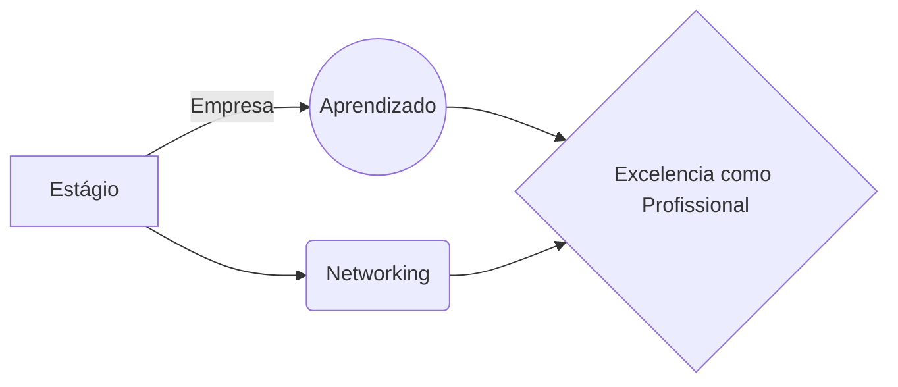

# Por que ***tech***?

Desde pequeno amo tecnologia e as novas formas com que o mundo se relaciona entre ela. Aficionado em história, ver o  avanço tecnológico sempre me deixou intrigado e muito pensativo para onde nós vamos futuramente. Hoje, após uma breve e muita curta carreira em arquitetura e urbanismo, decidi mudar de carreira de vez e seguir o mundo *tech*. 

Minha frase reflexiva favorita sobre a tecnologia vem de um dos cientistas mais brilhantes da humanidade:

> Tornou-se aterradoramente claro que a nossa tecnologia ultrapassou a nossa humanidade - Albert Einstein

## Minhas lutas

Optei por estudar Análise e Desenvolvimento de Sistemas que por um tempo, fez muito sentido e foi extremamente esclarecedor mas por motivos de mudanças na vida - um pouco turbulenta na época e outras mudanças pessoais que não foram de minha escolha mas necessárias - parte caótica dos últimos tempos, optei por cancelar o curso e tentar novamente um recomeço na área em São Paulo - SP. Atualmente curso Desenvolvimento de Software Multiplataforma na FATEC zona leste e estou amando o curso e trajeto que estou percorrendo dentro da instituição e diferente da minha primeira graduação, vejo um interesse enorme dos professores em preparar a sala para o mercado de trabalho.

Durante as diferentes fases usei diferentes linguagens: Java, HTML, CSS, C, Elixir, Javascript e SQL.

# (ง ͠° ͟ل͜ ͡°)ง

Minha tragetória atual:

